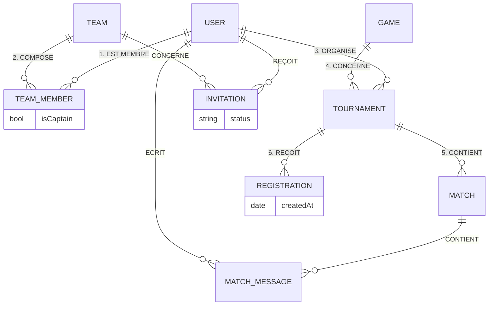

# Modèle Conceptuel de Données (MCD) - Mapping des 13 Tables

Ce document fait le lien entre les concepts du MCD (Entités/Relations) et les 13 tables physiques présentes dans la base de données.

## 1. Les Entités (Objets Métiers)
Ces tables correspondent directement aux objets principaux du modèle.

| Table Physique | Entité Conceptuelle | Description |
| :--- | :--- | :--- |
| **users** | **USER** | L'utilisateur de la plateforme. |
| **games** | **GAME** | Le jeu vidéo (référentiel). |
| **teams** | **TEAM** | L'équipe créée par des utilisateurs. |
| **tournaments** | **TOURNAMENT** | Le tournoi organisé. |
| **matches** | **MATCH** | La rencontre sportive. |
| **sessions** | **SESSION** | (Technique) La session de connexion Auth. |
| **notifications** | **NOTIFICATION** | (Technique) Les alertes utilisateurs. |

---

## 2. Les Relations transformées en Tables
Ces tables proviennent d'associations porteuses (n-n) ou complexes qui nécessitent une table intermédiaire.

| Table Physique | Association MCD | Entités reliées | Pourquoi une table ? |
| :--- | :--- | :--- | :--- |
| **team_members** | **ETRE_MEMBRE** | User ↔ Team | Relation portoise : contient le rôle (`isCaptain`). |
| **tournament_registrations** | **S_INSCRIRE** | User/Team ↔ Tournament | Relation portoise : contient la date d'inscription. |
| **match_messages** | **DISCUTER** | User ↔ Match | Relation 1-n devenue table pour stocker l'historique de chat. |
| **match_result_votes** | **VOTER_RESULTAT** | User ↔ Match | Relation pour valider le score (anti-triche). |
| **team_invitations** | **INVITER** | User ↔ Team | Relation pour gérer l'état 'En attente' avant de devenir membre. |
| **team_tournament_participants**| **PARTICIPER** | Registration ↔ TeamMember | (Technique) Lie une inscription aux membres spécifiques qui jouent. |

---

## 3. Synthèse des 13 Tables

*   **7 Entités** : `users`, `games`, `teams`, `tournaments`, `matches`, `sessions`, `notifications`.
*   **6 Relations** : `team_members`, `tournament_registrations`, `match_messages`, `match_result_votes`, `team_invitations`, `team_tournament_participants`.

---

## 4. Schéma Conceptuel Simplifié

