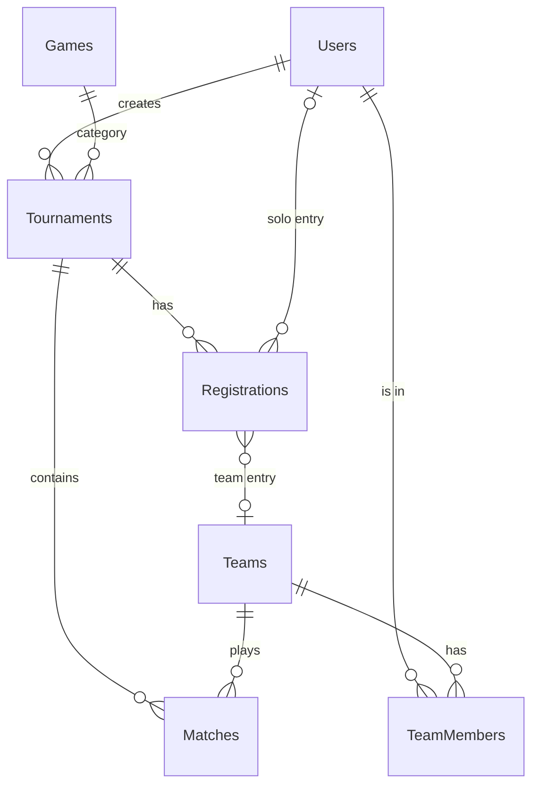

# Modèle Conceptuel de Données (MCD) - Braket

Ce document décrit la structure de la base de données, les entités, leurs relations et les cardinalités.

## 1. Liste des Entités

### **User** (Utilisateur)
Représente un utilisateur inscrit sur la plateforme.
*   **Identifiant** : `id`
*   **Attributs** : email, pseudo, passwordHash, avatarUrl, bannerUrl, isAdmin...

### **Tournament** (Tournoi)
Représente un tournoi créé par un organisateur.
*   **Identifiant** : `id`
*   **Attributs** : name, format (SINGLE_ELIMINATION, etc.), visibility, status, startDate...

### **Game** (Jeu)
Référentiel des jeux vidéo supportés (ex: CS2, LoL).
*   **Identifiant** : `id`
*   **Attributs** : name, slug, logoUrl, posterUrl.

### **Team** (Équipe)
Une équipe pouvant participer à des tournois.
*   **Identifiant** : `id`
*   **Attributs** : name, description, avatarUrl, bannerUrl.

### **TeamMember** (Membre d'équipe)
Table de jointure enrichie reliant un User à une Team.
*   **Identifiant** : `id`
*   **Attributs** : isCaptain, role.

### **Match**
Représente une rencontre entre deux équipes dans un tournoi.
*   **Identifiant** : `id`
*   **Attributs** : round, status, scheduledAt.

### **TournamentRegistration** (Inscription)
L'inscription d'un utilisateur ou d'une équipe à un tournoi.
*   **Identifiant** : `id`
*   **Attributs** : createdAt.

---

## 2. Relations et Cardinalités

Voici les relations entre les entités sous la forme : **Entité A - (Card A, Card B) - Entité B**
*(0,1) = Zéro ou un | (1,1) = Exactement un | (0,n) = Zéro ou plusieurs | (1,n) = Un ou plusieurs*

### Relations Utilisateurs (User)
*   **Organiser** : User `(0,n)` --- `(1,1)` Tournament
    *   *Un user peut organiser plusieurs tournois. Un tournoi est organisé par exactement un user.*
*   **Appartenir** : User `(0,n)` --- `(1,1)` TeamMember `(1,1)` --- `(0,n)` Team
    *   *Un user peut être membre de plusieurs équipes (via TeamMember). Une équipe a plusieurs membres.*
*   **Inviter (Équipe)** : User (Invited) `(0,n)` --- `(1,1)` TeamInvitation `(1,1)` --- `(0,n)` Team
*   **Envoyer Message** : User `(0,n)` --- `(1,1)` MatchMessage

### Relations Tournois (Tournament)
*   **Concerner** : Tournament `(0,1)` --- `(0,n)` Game
    *   *Un tournoi concerne un jeu (ou aucun si "Autre"). Un jeu peut avoir plusieurs tournois.*
*   **Contenir** : Tournament `(0,n)` --- `(1,1)` Match
    *   *Un tournoi contient plusieurs matchs. Un match appartient à un seul tournoi.*
*   **Recevoir** : Tournament `(0,n)` --- `(1,1)` TournamentRegistration
    *   *Un tournoi a plusieurs inscriptions.*

### Relations Matchs (Match)
*   **Jouer (Team A)** : Match `(1,1)` --- `(0,n)` Team
    *   *Un match a une équipe A.*
*   **Jouer (Team B)** : Match `(1,1)` --- `(0,n)` Team
    *   *Un match a une équipe B.*
*   **Gagner** : Match `(0,1)` --- `(0,n)` Team
    *   *Un match a (éventuellement) un vainqueur. Une équipe peut gagner plusieurs matchs.*

### Relations Inscriptions (TournamentRegistration)
*   **Inscrire (User)** : TournamentRegistration `(0,1)` --- `(0,n)` User
    *   *Pour les tournois solo.*
*   **Inscrire (Team)** : TournamentRegistration `(0,1)` --- `(0,n)` Team
    *   *Pour les tournois par équipe.*

---

## 3. Schéma Relationnel Simplifié

